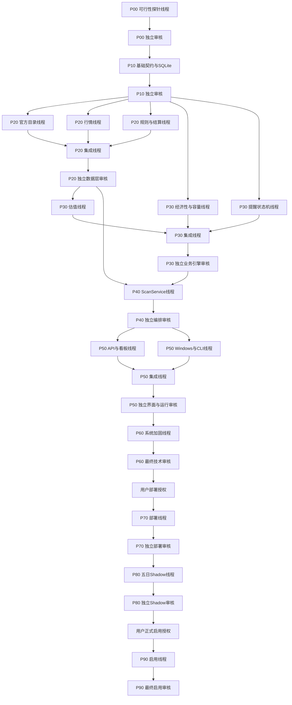

# 基金套利提醒系统：多线程并行开发与独立验收实施计划

> **For agentic workers:** REQUIRED SUB-SKILL: Use `superpowers:subagent-driven-development` or `superpowers:executing-plans`. Every phase uses fresh Codex threads and an independent acceptance thread.

**Goal:** 在不降低数据可信度和验收强度的前提下，通过独立 worktree 和阶段级并行，完成基金套利观察与提醒系统。

**Architecture:** 主线程只负责编排、记录 SHA 和处理用户决策，不直接开发。每个阶段由新开发线程完成；存在独立子系统时并行开发，再由新集成线程合成唯一候选；最后由从未参与该阶段开发的全新审核线程，对固定提交独立验收。

**Tech Stack:** Python 3.12、FastAPI、Uvicorn、Jinja2、Pydantic、Longbridge SDK、SQLite、Portalocker、pytest、Ruff、Windows Task Scheduler。

## 全局约束

- 基线：`master@0e841d7`，执行前重新核验 HEAD 和工作区。
- 只使用 `create_thread` 创建新线程，不从开发线程 `fork` 审核线程。
- 所有代码线程使用独立 Codex worktree。
- 同时最多运行 3 条写代码线程；只读审核线程可与无依赖的开发线程重叠。
- `codex/integration` 只允许在审核 PASS 后 `--ff-only` 前进。
- 不自动修改 `master`、不 push、不创建 PR。
- 不自动下单，不读取账户资产。
- 服务只绑定 `127.0.0.1`。
- 公共行情永远不能产生可执行提醒。
- 行情有效期固定为 5 分钟。
- 初始 `shadow_mode=true`、`alerts_enabled=false`、QDII 白名单为空。
- 任何重要路线、数据源、QDII 白名单、部署、push 或正式启用均由用户决定。

---

## 1. 线程编排制度

### 1.1 线程角色

每个阶段包含以下角色：

1. **开发线程**
   - 只实现、测试和 commit。
   - 不给正式 PASS。
   - 不合并、不 push。

2. **集成线程**
   - 只用于并行阶段。
   - 从该阶段固定 `PHASE_BASE_SHA` 开始。
   - 按指定顺序 cherry-pick 各开发线程提交。
   - 只处理机械性冲突；语义冲突立即 `BLOCKED`。
   - 形成唯一 `CANDIDATE_SHA`。

3. **独立审核线程**
   - 必须由 `create_thread` 全新创建。
   - 不继承开发或集成线程对话。
   - 使用独立 worktree。
   - 只审核固定 `CANDIDATE_SHA`，不修改源码、不 commit、不顺手修复。
   - 独立重跑测试，并增加自己的失败注入和复算样例。

4. **主协调线程**
   - 记录线程 ID、基线 SHA、候选 SHA、审核结论。
   - 创建和等待线程。
   - 只有审核 PASS 才推进 `codex/integration`。
   - 不代替审核线程判断通过。

### 1.2 创建方式

实施开始时：

1. 调用 `list_projects` 找到 `D:\Project\arbitrage-alert`。
2. 确认它是 Git 项目。
3. 每个线程通过 `create_thread` 创建为 project worktree。
4. `startingState` 指向最近一次已验收的集成分支。
5. 不指定模型或 reasoning override，沿用用户默认设置。
6. 创建后用 `set_thread_title` 设置下文规定的标题。
7. 用 `wait_threads` 批量等待并行线程，不反复读取完整历史。

### 1.3 分支与提交规则

- 固定集成分支：`codex/integration`
- 阶段候选：`codex/pNN-candidate`
- 返工分支：`codex/pNN-rNN-<slug>`
- 开发线程可小步 commit，但送审时必须：
  - 全部修改已提交；
  - `git status --porcelain` 为空；
  - 报告 `PHASE_BASE_SHA`、`CANDIDATE_SHA` 和 commit 列表。
- 送审后禁止 amend、rebase、squash 或继续修改。
- 候选发生任何变化，原审核结果立即失效。
- 审核证据保存在审核线程输出或临时证据目录，不为写入审核报告而改变候选提交。

### 1.4 审核结论

只允许：

- `PASS`
- `FAIL`
- `BLOCKED`

禁止“基本通过”“有条件通过”。

审核输出必须包含：

```text
phase_id:
audit_thread_id:
verdict:
gate_eligible:
plan_sha:
base_sha:
candidate_sha:
environment:
clean_before:
clean_after:
requirements_total / passed / failed / blocked:
```

每个问题必须包含：

- 问题 ID；
- `file:line`；
- 对应需求；
- 复现命令；
- 预期和实际；
- 影响；
- 最小修复建议。

### 1.5 返工制度

- `FAIL` 后不返回原开发线程。
- 创建全新返工线程，只处理审核问题 ID。
- 返工先增加复现测试，再做最小修复。
- 返工形成新 SHA 后，再创建全新审核线程。
- 原审核线程不得复用。
- `BLOCKED` 补齐环境或证据后，也要创建新的审核线程。
- 若返工要求改变数据源、架构或核心业务规则，停止并交由用户决策。

---

## 2. 并行执行 DAG



安全的跨阶段重叠：

- P30 的“经济性与容量”和“提醒状态机”只依赖 P10 冻结契约，可在 P20 数据线程运行时提前开发。
- P30 估值线程必须等 P20 数据层 PASS。
- P50 的 API/看板与 Windows/CLI 可以并行。
- P40 ScanService、P60 系统审核、P70 部署和 P80 Shadow 必须串行。

基础计划共 28 条新线程；失败时额外创建返工和复审线程。不会同时启动全部线程。

---

## 3. P00：数据可行性与计划冻结

线程：

- `AA-P00-Feasibility-DEV`
- `AA-P00-Feasibility-AUDIT`

开发线程任务：

- 将本计划固定为 `PLAN_SHA`。
- 在不建设正式架构前完成最小只读探针：
  - 上交所基金目录及分页；
  - 深交所基金目录及分页；
  - Longbridge 中国市场权限；
  - 代表性沪深 LOF 的价格、源时间和交易状态；
  - 折价方向所需卖盘；
  - 东财和腾讯是否提供可比较字段及时间。
- 代表性集合至少覆盖：
  - 沪深各 10 只；
  - 国内指数 LOF；
  - QDII-LOF；
  - ETF；
  - 无成交或停牌样本。
- 不保存或输出凭据。
- 只 commit 计划文档，不把临时探针数据混入源码。

审核线程：

- 独立复核计划内容。
- 在交易时段重新执行关键只读探针。
- 不采用开发线程的“可用”结论。
- 明确区分认证成功、报价可得、时间可信、盘口可得四项。

硬停止线：

- 官方目录无法证明可以闭合；
- Longbridge 无中国市场权限；
- 重点 LOF 行情或卖方盘口不可得；
- 需要采用登录态、未公开或未批准数据源；
- 公共源没有可比较时间和价格字段。

P00 未 PASS，不进入正式开发。

---

## 4. P10：基础契约、配置和 SQLite

线程：

- `AA-P10-Foundation-DEV`
- `AA-P10-Foundation-AUDIT`

主要文件：

- `pyproject.toml`
- `requirements-app.lock`
- `requirements-dev.lock`
- `backend/app/config/settings.py`
- `backend/app/models/*.py`
- `backend/app/providers/base.py`
- `backend/app/repositories/migrations/001_initial.sql`
- `backend/app/repositories/sqlite_repository.py`
- `tests/unit/test_settings.py`
- `tests/unit/test_domain_models.py`
- `tests/integration/test_sqlite_repository.py`

固定依赖：

- Python `3.12.x`
- FastAPI `0.139.2`
- Uvicorn `0.51.0`
- Jinja2 `3.1.6`
- Pydantic `2.13.4`
- Longbridge `4.4.2`
- Portalocker `3.2.0`

冻结契约：

- `InstrumentId`
- `Instrument`
- `SourceEvidence`
- `QuoteSnapshot`
- `FundRuleSnapshot`
- `SettlementRule`
- `ValuationSnapshot`
- `Opportunity`
- `ScanTrigger`
- `ScanRun`
- `AlertEpisode`
- `NotificationOutboxEvent`
- 所有 provider/repository/service Protocol。

关键规则：

- 金额、价格、比例全部使用 `Decimal`。
- SQLite 以字符串保存 Decimal。
- 所有时间带时区。
- `RunStatus`：
  `running/completed/failed/skipped/missed`
- `QualityStatus`：
  `passed/degraded/blocked`
- 只有原子提交的 completed run 能被页面读取。
- degraded run 只能显示观察结果，不推进提醒 episode。
- failed run 不覆盖最后 completed run。
- 扫描开始时固定：
  - catalog version；
  - settings revision；
  - manual verification revision；
  - rule version；
  - valuation profile version；
  - config hash。
- 公式回放必须使用这组固定版本，不能读取扫描结束时的新设置。

数据库表至少包括：

- instruments
- catalog_snapshots
- scan_runs
- quote/rule/valuation snapshots
- opportunities
- source_health
- manual_verifications
- settings_revisions
- daily_quota_usage
- alert_episodes
- notification_outbox
- shadow_validation_days

事务规则：

- opportunity、覆盖指标、episode 变化和 outbox 同事务提交。
- 网络请求不占用 SQLite 写事务。
- 唯一 `trigger_id` 和 `event_id`。
- 页面永远看不到半成品。
- V1 不自动删除历史。

必需投资设置无可执行默认值：

- 单机会资金上限；
- 最低净边际；
- 佣金率和最低佣金；
- 分类误差垫；
- 分类持有风险垫；
- 溢价流动性/滑点垫。

缺任一项时 `execution_ready=false`。

审核必须独立测试：

- 崩溃恢复；
- 重复 trigger/event；
- Decimal 往返；
- 事务回滚；
- latest completed；
- 设置在扫描中途变化不影响既有 run；
- Secret 不进入序列化、数据库和日志。

P10 PASS 后，领域模型、Protocol 和 `001_initial.sql` 冻结。后续线程需要改变时必须暂停并重开契约修订阶段。

---

## 5. P20：数据层三路并行

### P20-A 官方目录线程

标题：`AA-P20-Catalog-DEV`

文件所有权：

- `sse_catalog_provider.py`
- `szse_catalog_provider.py`
- `domain/classification.py`
- `services/catalog_service.py`
- 对应 fixtures 和测试。

要求：

- 使用沪深交易所官方来源。
- 完整分页、总数闭合、代码唯一。
- 记录新增、改名、退市、分类变化。
- 所有基金 100% 进入：
  - `executable_candidate`
  - `watch`
  - `data_insufficient`
  - `not_applicable`
- 绝不按行情源或 Top-N 缩池。
- 目录失败可以显示最后成功目录，但不得伪装成当日目录。

### P20-B 行情线程

标题：`AA-P20-Quotes-DEV`

文件所有权：

- `longbridge_quote_provider.py`
- `eastmoney_quote_provider.py`
- `tencent_quote_provider.py`
- `domain/quote_resolution.py`
- `domain/quality.py`
- `services/quote_service.py`
- `tools/probe_longbridge_coverage.py`

要求：

- Longbridge 每批最多 500 个证券。
- 全量基础 quote；折价候选按需获取卖盘。
- 行情有效期不超过 300 秒。
- 公共双源必须同时成功并满足：

```text
mid = (p1 + p2) / 2
abs(p1 - p2) / mid <= max(0.002, 2 * tick_size / mid)
```

- 公共双源即使一致也只能 `public_degraded/watch`。
- 单公共源、冲突或过期一律不足。
- Palmmicro 仅 `reference_only`。

指标：

- `display_quote_coverage >= 95%`
- `trusted_execution_quote_coverage`
- 可信覆盖相对上次成功扫描下降不得超过 5 个百分点。
- 第一次成功扫描只建立基线，不启用提醒。

### P20-C 规则与结算线程

标题：`AA-P20-Rules-DEV`

文件所有权：

- `official_nav_provider.py`
- `exchange_calendar_provider.py`
- `domain/settlement.py`
- `services/evidence_service.py`
- `services/rule_service.py`

要求：

- 自动官方信息或人工核验的官方/券商证据可以支持执行。
- 聚合站信息只能观察。
- 人工核验采用追加修订，记录来源、原文位置、有效期、费率、限额、渠道和份额类别。
- 撤销通过新修订完成，不删除历史。
- `expected_holding_days` 从已验证结算规则和官方交易日历推导。
- 未知限额不能当无限额。
- 当日人工已使用额度默认 0，但页面必须警告。

### P20 集成与审核

线程：

- `AA-P20-Data-Integrate`
- `AA-P20-Data-AUDIT`

集成顺序：

1. Catalog
2. Quotes
3. Rules

集成线程不得修改 P10 冻结契约。

审核线程必须：

- 重新抓取官方全集；
- 核验总数、唯一性和 100% 分类；
- 在市场时段运行 Longbridge 全集覆盖探针；
- 检查重点 LOF 卖盘；
- 验证公共源冲突和过期降级；
- 检查证据过期、渠道未知和日历冲突；
- 验证任何公共源路径都不能产生 executable。

P20 是核心数据硬门。FAIL 或 BLOCKED 时，不建设 ScanService 和 UI。

---

## 6. P30：业务引擎三路并行

### P30-A 经济性与容量线程

标题：`AA-P30-Economics-DEV`

可在 P20 运行时，从 P10 PASS 基线提前启动。

文件：

- `domain/fees.py`
- `domain/capacity.py`
- `domain/opportunity.py`
- 对应单元测试。

必须实现：

```python
subscription_units(amount_cny, nav, fee_schedule)
sell_proceeds(units, price, commission_schedule)
buy_units(amount_cny, orderbook, commission_schedule)
redemption_proceeds(units, nav, holding_days, fee_schedule)
```

溢价：

```text
gross_edge = (market_price - estimated_nav) / estimated_nav
net_edge = net_profit / subscription_cash
```

容量不受当前买盘限制，取：

- 全局单机会资金上限；
- 申购剩余额度；
- 当日人工已使用额度后的余额；

三者最小值，并扣除固定流动性/滑点垫。

折价：

```text
gross_edge = (estimated_nav - market_price) / market_price
net_edge = net_profit / actual_orderbook_buy_cost
```

按卖盘逐档、交易单位、最低佣金和费率档计算，取仍满足净边际阈值的最大人民币金额。

页面和模型必须分开保存毛边际、净边际、容量金额和首要约束。

### P30-B 提醒状态机线程

标题：`AA-P30-Alerts-DEV`

也可从 P10 PASS 基线提前启动。

文件：

- `domain/alert_policy.py`
- `notifications/serverchan.py`
- `notifications/outbox_worker.py`
- 对应测试。

规则：

- 首次进入提醒；
- 持续机会不重复提醒；
- 三次连续合格退出后重新武装；
- 中间重新进入则退出计数归零；
- failed、degraded、data insufficient 和可信源丢失不增加也不清零退出次数；
- 状态推进扫描至少相隔五分钟；
- event ID 确定性生成；
- outbox 正文在事务中固定，提交后发送；
- 启动时补发 pending；
- 响应丢失允许少量重复，但不得丢事件；
- 消息显示 event ID 前八位；
- SendKey 不进入 URL 日志或异常信息。

必须故障注入：

- 提交前崩溃；
- 提交后、发送前崩溃；
- HTTP 已送达但响应丢失。

### P30-C 估值线程

标题：`AA-P30-Valuation-DEV`

必须等 P20 PASS。

文件：

- `models/valuation_profile.py`
- `domain/valuation.py`
- `services/valuation_service.py`
- `exchange_iopv_provider.py`
- 对应 fixtures 和测试。

国内被动指数 LOF：

```text
estimated_nav =
    official_base_nav
    × (1 + benchmark_return_since_base)
```

QDII：

```text
estimated_nav =
    base_nav
    × proxy_return_factor
    × fx_conversion_factor
```

要求：

- 估值信号仅来自 Longbridge 或批准的官方指数/FX 来源。
- 基准、净值、时间或映射缺失时阻断。
- QDII 白名单初始为空。
- 实施线程不得自行选择近似 proxy。
- ETF 只有可信、有时间戳的 IOPV 才显示理论观察。
- ETF 在 V1 永远不可执行。
- 无 IOPV 不得填零或沿用旧值。
- V1 不自动进行 40/60 日阈值校准。

### P30 集成与审核

线程：

- `AA-P30-Engines-Integrate`
- `AA-P30-Engines-AUDIT`

集成基线必须是 P20 PASS 后的 SHA。经济性和提醒提交若来自旧基线，只允许无语义冲突的 cherry-pick。

独立审核必须使用审核者自己建立的金额样例复算：

- 最低佣金；
- 金额和持有期费率档；
- 逐档卖盘；
- 交易单位取整；
- 无限额和未知限额；
- 估值误差垫和持有风险垫；
- QDII FX 正反报价；
- ETF IOPV 缺失；
- episode 三次退出和五分钟门；
- outbox 三类崩溃点。

---

## 7. P40：统一 ScanService

线程：

- `AA-P40-ScanService-DEV`
- `AA-P40-ScanService-AUDIT`

文件：

- `services/scan_service.py`
- `services/scan_coordinator.py`
- `bootstrap.py`
- `tools/scan_once.py`
- 集成测试。

固定流水线：

1. 固化设置、目录、规则、人工核验和配置版本。
2. 预留 trigger ID。
3. 获取跨进程 Portalocker 文件锁。
4. 核验交易日。
5. 同步目录。
6. 获取行情。
7. 解析规则和结算。
8. 计算估值。
9. 计算毛/净边际和容量。
10. 计算质量门。
11. 推进 episode。
12. 原子提交 run、快照和 outbox。
13. 提交后发送通知。

并发规则：

- FastAPI 和计划任务使用同一跨进程锁。
- 不依赖 Python 内存锁。
- 手动扫描遇到锁返回 `409`。
- 定时扫描等待到 14:30。
- 进程退出自动释放文件锁。
- 启动时把遗留 `running` run 标记为失败。
- `scheduled:YYYY-MM-DD` 保证幂等。

审核必须验证：

- CLI 和直接 ScanService 结果一致；
- 无 Top-N；
- 质量门失败不提醒、不推进 episode；
- failed 不替换 latest completed；
- degraded 原子显示但只能观察；
- 并发 API/CLI 不产生双扫描；
- 设置在运行中更新不改变已固化输入；
- 14:30 后标记 missed，不能伪装为 14:00 扫描。

---

## 8. P50：界面与本地运行双路并行

### P50-A API 与看板线程

标题：`AA-P50-Dashboard-DEV`

文件：

- `api/main.py`
- `api/schemas.py`
- `templates/index.html`
- `static/app.js`
- `static/styles.css`
- API/UI 测试。

接口：

- `GET /`
- `GET /healthz`
- `GET /api/scans/latest`
- `POST /api/scans`
- `GET /api/scans/{run_id}`
- `GET /api/coverage`
- `GET /api/source-health`
- `GET/PUT /api/settings`
- `GET/POST /api/manual-verifications`

页面必须显示：

- 基金代码、名称、方向和状态；
- 毛边际；
- 净边际；
- 最大估算容量人民币；
- 行情价格和时间；
- 估值置信/缓冲；
- 容量首要约束；
- 证据来源和有效期；
- 阻断原因；
- Shadow 横幅；
- “容量不是仓位建议”。

安全：

- 仅绑定 `127.0.0.1:8765`；
- 不启用 CORS；
- Trusted Host 仅 localhost；
- API 不返回秘密；
- 页面不读取 running run。

### P50-B Windows、CLI 和 CI 线程

标题：`AA-P50-Windows-DEV`

文件：

- `tools/run_server.py`
- `tools/run_scheduled_scan.py`
- `tools/run_check.py`
- `scripts/start_server.ps1`
- `scripts/install_windows_tasks.ps1`
- `scripts/uninstall_windows_tasks.ps1`
- `.github/workflows/daily-check.yml`
- `README.md`
- `docs/USAGE.md`

要求：

- 登录启动本地网页。
- 工作日 14:00 触发后再检查官方交易日历。
- 唤醒计算机。
- 忙碌等待至 14:30。
- 固定 venv 和绝对路径。
- 脚本支持 `-WhatIf`。
- 卸载只删除两个精确任务，不删数据库和日志。
- `run_check.py` 变成 ScanService 薄入口。
- 旧 `--top` 不得再缩小扫描全集。
- GitHub workflow 去除定时机会推送，保留手动 smoke/CI；本地修改不 push。

### P50 集成与审核

线程：

- `AA-P50-Surface-Integrate`
- `AA-P50-Surface-AUDIT`

审核包括：

- 独立 API contract 测试；
- 真实启动服务；
- 浏览器打开 `http://127.0.0.1:8765/`；
- 手动刷新、设置和人工核验流程；
- 进程重启后历史读取；
- 端口占用和错误日志；
- Windows 脚本 `-WhatIf`；
- 任务参数中无密钥；
- 旧 CLI 不再直接调用 Palmmicro 或 `determine_level()`；
- GitHub workflow 无推送路径。

本阶段不实际注册任务、不发送真实 Server酱消息。

---

## 9. P60：系统加固和最终技术候选

线程：

- `AA-P60-System-RC-DEV`
- `AA-P60-System-RC-AUDIT`

开发线程只允许：

- 增加端到端测试；
- 增加 `tools/export_shadow_report.py`；
- 修复集成缺陷；
- 补齐日志脱敏和故障注入；
- 不增加新产品范围。

完整验证：

```powershell
python -m ruff check backend tools tests
python -m pytest -m "not live" --cov=app --cov-branch --cov-report=term-missing
python -m compileall backend tools
python -m pip check
git diff --check
```

要求：

- `backend/app/domain` 分支覆盖率不低于 95%。
- 关键金融分支全部有明确用例，不能只凭覆盖率。
- 全新虚拟环境、空数据库和无缓存状态通过。
- Windows 和 Ubuntu 核心测试通过。
- live 测试不进入无凭据 CI。
- 无密钥、数据库、日志或缓存进入 Git。

P60 审核线程必须从完整设计重新建立矩阵，不得把前面各阶段 PASS 当作整体 PASS 的替代。

P60 PASS 后形成固定 `RELEASE_CANDIDATE_SHA`。

---

## 10. P70：本地部署

前置重要决策：

用户确认以下事项后才能开始：

- 将已验收候选 fast-forward 到稳定运行路径；
- 创建 `%LOCALAPPDATA%\ArbitrageAlert`；
- 注册两个 Windows 任务；
- 发送一条明确标注 `[TEST]` 的 Server酱消息。

线程：

- `AA-P70-Deploy-EXEC`
- `AA-P70-Deploy-AUDIT`

部署线程：

- 重新核验 master 无意外变化。
- 不把任务指向临时 Codex worktree。
- 安装锁定依赖。
- 初始化数据库。
- 注册登录任务和 14:00 任务。
- 启动服务并发送测试消息。
- 不 push。

审核线程独立检查：

- 任务计划真实定义；
- Python 和工作目录绝对路径；
- 服务只监听 `127.0.0.1`；
- `/healthz`；
- SQLite 和日志路径；
- 环境变量只显示“已配置/未配置”；
- 任务重启、单实例和卸载恢复；
- 没有新旧本地调度双重发送。

若发现代码缺陷，不在部署线程补代码；退回新的 P60 返工与复审。

---

## 11. P80：连续五交易日 Shadow

线程：

- `AA-P80-Shadow-OPS`
- `AA-P80-Shadow-AUDIT`

Shadow 期间固定：

```text
shadow_mode=true
alerts_enabled=false
QDII whitelist=[]
```

运行线程负责逐日读取和保存：

- run/event ID；
- 官方目录总数和分类；
- 展示/可信行情覆盖率；
- 缺失、过期和降级差集；
- 所有影子候选的固化输入；
- 毛边际、净边际和容量；
- 人工复算；
- outbox、日报、异常和恢复记录。

同一 Shadow 线程可在每天扫描后用 `send_message_to_thread` 唤醒继续，不必每天新建线程，因为五日证据必须保持连续。除非用户另行要求，不创建 Codex 定时自动化。

连续五日通过条件：

- 官方目录分类 100%；
- 每日展示行情覆盖率不低于 95%；
- 可信执行覆盖按规则稳定；
- 无错误 executable；
- 所有公式可复算；
- episode/outbox 正常；
- 页面无半成品；
- 通知成功、失败和恢复符合设计。

以下情况立即清零：

- 代码、依赖或行为配置变化；
- 目录漏项；
- 错误 executable；
- 公式不可复算；
- episode/outbox 错误；
- 跨进程双扫描；
- 页面读取半成品。

五日结束后创建全新 `AA-P80-Shadow-AUDIT`。它只读取固定代码 SHA、五份原始证据和数据库记录，不依赖 Shadow 运行线程总结。

---

## 12. P90：正式启用

前置重要决策：

用户查看 P80 审核结果并明确确认后，才允许启用。

线程：

- `AA-P90-Activate-EXEC`
- `AA-P90-Activate-AUDIT`

启用线程只执行：

- 再次确认代码、依赖和行为配置未变化；
- 确认 QDII 白名单仍为空；
- 设置：
  - `shadow_mode=false`
  - `alerts_enabled=true`
- 验证下一次手动扫描仍受完整证据和质量门控制。
- 不自动 push。

最终审核线程检查：

- Shadow PASS 对应的仍是当前运行 SHA；
- 没有跳过必需投资设置；
- 公共行情仍不可执行；
- episode 没有因启用动作重置或重复；
- 计划任务只有一条正式扫描路径；
- Server酱消息包含短 event ID；
- 无自动下单和账户访问路径。

只有以下三项同时成立，系统才可称为正式提醒已上线：

1. P60 最终技术审核 PASS；
2. P80 连续五交易日审核 PASS；
3. 用户明确手动启用且 P90 审核 PASS。

Git push、远端 GitHub workflow 生效和增加 QDII 白名单仍是独立的重要决策，不因本计划自动授权。
